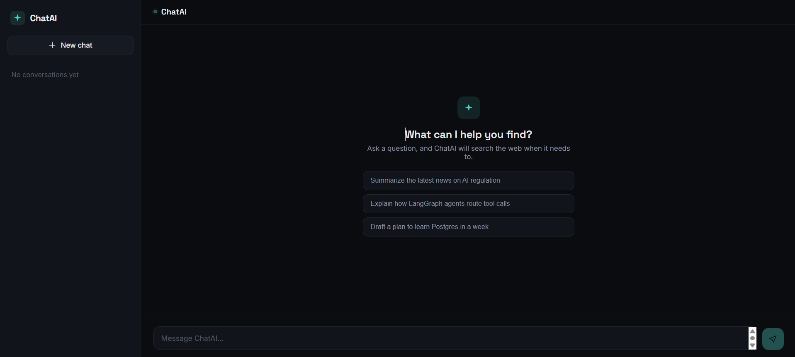

# ChatAI

AI chatbot built with **React**, **Node.js**, **Express.js**, **PostgreSQL**, and **Sequelize**. The application provides a ChatGPT-inspired interface with persistent conversation history, multiple chat sessions, AI-powered responses, and optional real-time web search using Tavily Search API.

Designed with a modular architecture, the project demonstrates full-stack development, REST API design, database integration, third-party API integration, and modern frontend development.

---

## Features

- AI-powered conversational assistant
- ChatGPT-inspired responsive interface
- Multiple conversation sessions
- Persistent chat history stored in PostgreSQL
- Web search integration using Tavily API
- Context-aware AI responses
- RESTful backend architecture
- Modular and scalable codebase
- Clean user experience

---

## Tech Stack

### Frontend

- React
- Vite
- Axios
- CSS

### Backend

- Node.js
- Express.js
- Sequelize ORM

### Database

- PostgreSQL

### AI & APIs

- Groq API
- Tavily Search API

---


# Installation

## Clone Repository

```bash
git clone https://github.com/yourusername/chatai.git

cd chatai
```

---

## Backend

```bash
cd backend

npm install
```

---

## Environment Variables

Create a `.env` file inside the backend folder.

```env
PORT=5000

DB_HOST=localhost
DB_PORT=5432
DB_NAME=chatbot
DB_USER=postgres
DB_PASSWORD=your_password
GROQ_API_KEY=your_groq_key
TAVILY_API_KEY=your_tavily_key
```

---

## Start Backend

```bash
npm run dev
```

or

```bash
node server.js
```

Backend runs at

```
http://localhost:5000
```

---

## Frontend

```bash
cd frontend

npm install

npm run dev
```

Frontend runs at

```
http://localhost:5173
```

---

## PostgreSQL Setup

Create a PostgreSQL database.

```sql
CREATE DATABASE chatbot;
```

Sequelize automatically creates the required tables.

---

## Screenshots

### Home Screen




